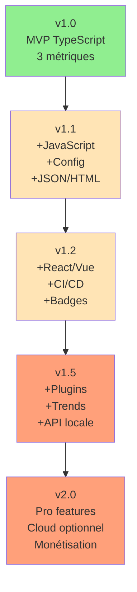

# InsightCode CLI - Architecture Technique v2.0

## Table des Matières
1. [Philosophie et Contraintes](#1-philosophie-et-contraintes)
2. [Architecture Globale](#2-architecture-globale)
3. [Structure du Projet](#3-structure-du-projet)
4. [Spécifications Détaillées](#4-spécifications-détaillées)
5. [Algorithmes Core](#5-algorithmes-core)
6. [Guide d'Implémentation IA](#6-guide-dimplémentation-ia)
7. [Exemples Complets](#7-exemples-complets)
8. [Checklist de Validation](#8-checklist-de-validation)

---

## 1. Philosophie et Contraintes

### 1.1 Principes KISS (Keep It Stupid Simple)
```yaml
Règles d'or:
  - Si ça prend plus de 100 lignes, c'est trop complexe
  - Si ça nécessite plus de 2 dépendances, repense
  - Si l'IA ne comprend pas en 1 prompt, simplifie
  - Si ça marche à 80%, ship it (perfection = ennemi)
```

### 1.2 Contraintes Side Project
- **Temps:** 2-4h/jour maximum
- **Maintenance:** < 1h/semaine
- **Tests:** Seulement les critiques (pas 100% coverage)
- **Docs:** README + exemples suffisent
- **Code:** Lisible > Optimal

### 1.3 Stack Minimaliste
```json
{
  "dependencies": {
    "commander": "^11.0.0",     // CLI framework
    "typescript": "^5.0.0",      // Parser + Compiler API
    "chalk": "^5.0.0",          // Couleurs terminal
    "fast-glob": "^3.0.0"       // Recherche fichiers
  },
  "devDependencies": {
    "vitest": "^1.0.0",         // Tests rapides
    "tsx": "^4.0.0"             // Dev sans build
  }
}
```

---

## 2. Architecture Globale

### 2.1 Flow Simple en 4 Étapes
```
Fichiers TS → Parser → Analyzer → Reporter
     ↓           ↓          ↓          ↓
  [*.ts]    [AST+Metrics] [Score]  [Console]
```

### 2.2 Modules (1 fichier = 1 responsabilité)
```typescript
src/
├── cli.ts        // Point d'entrée (50 lignes)
├── parser.ts     // AST + métriques de base (100 lignes)
├── analyzer.ts   // Calcul des 3 métriques (150 lignes)
├── reporter.ts   // Affichage coloré (100 lignes)
└── types.ts      // Interfaces TypeScript (50 lignes)
```

---

## 3. Structure du Projet

### 3.1 Organisation Fichiers
```
insightcode-cli/
├── src/
│   ├── cli.ts          # Entry point Commander
│   ├── parser.ts       # TypeScript AST parser
│   ├── analyzer.ts     # Métriques calculation
│   ├── reporter.ts     # Terminal output
│   └── types.ts        # Types partagés
├── tests/
│   ├── fixtures/       # Projets de test
│   └── analyzer.test.ts # Tests critiques
├── package.json
├── tsconfig.json
├── README.md           # Doc principale
└── .gitignore
```

### 3.2 Configuration TypeScript
```json
{
  "compilerOptions": {
    "target": "ES2022",
    "module": "commonjs",
    "lib": ["ES2022"],
    "outDir": "./dist",
    "rootDir": "./src",
    "strict": true,
    "esModuleInterop": true,
    "skipLibCheck": true,
    "forceConsistentCasingInFileNames": true,
    "resolveJsonModule": true,
    "declaration": true,
    "declarationMap": true
  },
  "include": ["src/**/*"],
  "exclude": ["node_modules", "dist", "tests"]
}
```

---

## 4. Spécifications Détaillées

### 4.1 Types Core (types.ts)
```typescript
// Configuration simple
export interface AnalyzeOptions {
  path?: string;           // Défaut: process.cwd()
  exclude?: string[];      // Défaut: ['node_modules', 'dist']
  json?: boolean;         // Défaut: false
}

// Résultat par fichier
export interface FileMetrics {
  path: string;
  complexity: number;      // Cyclomatic complexity
  duplication: number;     // % lignes dupliquées
  loc: number;            // Lines of code (sans comments)
}

// Résultat global
export interface AnalysisResult {
  score: number;          // 0-100
  grade: string;          // A-F
  files: FileMetrics[];
  summary: {
    totalFiles: number;
    totalLoc: number;
    avgComplexity: number;
    duplicationRate: number;
    topIssues: Issue[];
  };
}

// Issue détectée
export interface Issue {
  file: string;
  line: number;
  type: 'complexity' | 'duplication' | 'size';
  severity: 'high' | 'medium' | 'low';
  message: string;
}
```

### 4.2 CLI Entry Point (cli.ts)
```typescript
#!/usr/bin/env node
import { Command } from 'commander';
import { analyze } from './analyzer';
import { report } from './reporter';
import { version } from '../package.json';

const program = new Command();

program
  .name('insightcode')
  .description('TypeScript code quality analyzer')
  .version(version);

program
  .command('analyze [path]')
  .description('Analyze TypeScript project quality')
  .option('-e, --exclude <patterns...>', 'Exclude patterns', ['node_modules', 'dist', '*.spec.ts'])
  .option('-j, --json', 'Output JSON format')
  .action(async (path = '.', options) => {
    try {
      const result = await analyze({
        path,
        exclude: options.exclude,
        json: options.json
      });
      
      if (options.json) {
        console.log(JSON.stringify(result, null, 2));
      } else {
        report(result);
      }
      
      // Exit code basé sur le score
      process.exit(result.grade === 'F' ? 1 : 0);
    } catch (error) {
      console.error('❌ Error:', error.message);
      process.exit(1);
    }
  });

program.parse();
```

### 4.3 Parser Simple (parser.ts)
```typescript
import * as ts from 'typescript';
import * as fs from 'fs';
import * as path from 'path';
import glob from 'fast-glob';
import { FileMetrics } from './types';

export async function parseProject(projectPath: string, exclude: string[]): Promise<FileMetrics[]> {
  // Trouver tous les fichiers TS
  const files = await glob('**/*.{ts,tsx}', {
    cwd: projectPath,
    ignore: exclude,
    absolute: true
  });
  
  return files.map(parseFile).filter(Boolean);
}

function parseFile(filePath: string): FileMetrics | null {
  try {
    const content = fs.readFileSync(filePath, 'utf-8');
    const sourceFile = ts.createSourceFile(
      filePath,
      content,
      ts.ScriptTarget.Latest,
      true
    );
    
    // Calculer métriques de base
    const complexity = calculateComplexity(sourceFile);
    const loc = countLinesOfCode(content);
    
    return {
      path: filePath,
      complexity,
      duplication: 0, // Sera calculé après
      loc
    };
  } catch (error) {
    console.warn(`⚠️  Skipping ${filePath}: ${error.message}`);
    return null;
  }
}

function calculateComplexity(sourceFile: ts.SourceFile): number {
  let complexity = 1; // Base complexity
  
  function visit(node: ts.Node) {
    // Incrémenter pour chaque point de décision
    switch (node.kind) {
      case ts.SyntaxKind.IfStatement:
      case ts.SyntaxKind.ConditionalExpression:
      case ts.SyntaxKind.CaseClause:
      case ts.SyntaxKind.CatchClause:
      case ts.SyntaxKind.ConditionalType:
      case ts.SyntaxKind.ForStatement:
      case ts.SyntaxKind.ForInStatement:
      case ts.SyntaxKind.ForOfStatement:
      case ts.SyntaxKind.WhileStatement:
      case ts.SyntaxKind.DoStatement:
        complexity++;
        break;
      case ts.SyntaxKind.BinaryExpression:
        const op = (node as ts.BinaryExpression).operatorToken.kind;
        if (op === ts.SyntaxKind.AmpersandAmpersandToken || 
            op === ts.SyntaxKind.BarBarToken) {
          complexity++;
        }
        break;
    }
    
    ts.forEachChild(node, visit);
  }
  
  visit(sourceFile);
  return complexity;
}

function countLinesOfCode(content: string): number {
  return content
    .split('\n')
    .filter(line => {
      const trimmed = line.trim();
      return trimmed.length > 0 && 
             !trimmed.startsWith('//') &&
             !trimmed.startsWith('/*') &&
             !trimmed.startsWith('*');
    })
    .length;
}
```

### 4.4 Analyzer avec Détection Duplication (analyzer.ts)
```typescript
import { parseProject } from './parser';
import { AnalyzeOptions, AnalysisResult, FileMetrics, Issue } from './types';
import * as crypto from 'crypto';
import * as fs from 'fs';

export async function analyze(options: AnalyzeOptions): Promise<AnalysisResult> {
  // Parser tous les fichiers
  const files = await parseProject(options.path || '.', options.exclude || ['node_modules', 'dist']);
  
  // Détecter duplication
  detectDuplication(files);
  
  // Calculer score global
  const score = calculateScore(files);
  const grade = getGrade(score);
  
  // Identifier top issues
  const topIssues = findTopIssues(files);
  
  // Statistiques
  const totalLoc = files.reduce((sum, f) => sum + f.loc, 0);
  const avgComplexity = files.reduce((sum, f) => sum + f.complexity, 0) / files.length;
  const totalDuplication = files.reduce((sum, f) => sum + f.duplication * f.loc, 0);
  const duplicationRate = totalDuplication / totalLoc;
  
  return {
    score,
    grade,
    files,
    summary: {
      totalFiles: files.length,
      totalLoc,
      avgComplexity: Math.round(avgComplexity * 10) / 10,
      duplicationRate: Math.round(duplicationRate * 100) / 100,
      topIssues
    }
  };
}

function detectDuplication(files: FileMetrics[]): void {
  // Stratégie simple: hash de blocs de 5 lignes
  const blockSize = 5;
  const hashes = new Map<string, string[]>();
  
  for (const file of files) {
    try {
      const content = fs.readFileSync(file.path, 'utf-8');
      const lines = content.split('\n').filter(l => l.trim().length > 0);
      
      let duplicatedLines = 0;
      
      for (let i = 0; i <= lines.length - blockSize; i++) {
        const block = lines.slice(i, i + blockSize).join('\n');
        const hash = crypto.createHash('md5').update(block).digest('hex');
        
        if (hashes.has(hash)) {
          duplicatedLines += blockSize;
        } else {
          hashes.set(hash, [file.path]);
        }
      }
      
      file.duplication = Math.min(100, (duplicatedLines / lines.length) * 100);
    } catch {
      file.duplication = 0;
    }
  }
}

function calculateScore(files: FileMetrics[]): number {
  if (files.length === 0) return 100;
  
  // Moyennes pondérées
  const avgComplexity = files.reduce((sum, f) => sum + f.complexity, 0) / files.length;
  const avgDuplication = files.reduce((sum, f) => sum + f.duplication, 0) / files.length;
  
  // Score de complexité (0-100, 10 = parfait, 30+ = mauvais)
  const complexityScore = Math.max(0, 100 - (avgComplexity - 10) * 3);
  
  // Score de duplication (0-100, 0% = parfait, 20%+ = mauvais)
  const duplicationScore = Math.max(0, 100 - avgDuplication * 5);
  
  // Maintainability composite
  const maintainabilityScore = (complexityScore + duplicationScore) / 2;
  
  // Score final avec poids
  return Math.round(
    complexityScore * 0.4 +
    duplicationScore * 0.3 +
    maintainabilityScore * 0.3
  );
}

function getGrade(score: number): string {
  if (score >= 90) return 'A';
  if (score >= 80) return 'B';
  if (score >= 70) return 'C';
  if (score >= 60) return 'D';
  return 'F';
}

function findTopIssues(files: FileMetrics[]): Issue[] {
  const issues: Issue[] = [];
  
  for (const file of files) {
    // Complexité élevée
    if (file.complexity > 20) {
      issues.push({
        file: file.path,
        line: 0,
        type: 'complexity',
        severity: file.complexity > 30 ? 'high' : 'medium',
        message: `Complexité élevée: ${file.complexity} (max recommandé: 20)`
      });
    }
    
    // Duplication élevée
    if (file.duplication > 15) {
      issues.push({
        file: file.path,
        line: 0,
        type: 'duplication',
        severity: file.duplication > 25 ? 'high' : 'medium',
        message: `Code dupliqué: ${Math.round(file.duplication)}%`
      });
    }
    
    // Fichier trop long
    if (file.loc > 300) {
      issues.push({
        file: file.path,
        line: 0,
        type: 'size',
        severity: file.loc > 500 ? 'high' : 'medium',
        message: `Fichier trop long: ${file.loc} lignes (max recommandé: 300)`
      });
    }
  }
  
  // Retourner top 5 issues par sévérité
  return issues
    .sort((a, b) => {
      const severityOrder = { high: 0, medium: 1, low: 2 };
      return severityOrder[a.severity] - severityOrder[b.severity];
    })
    .slice(0, 5);
}
```

### 4.5 Reporter avec Style (reporter.ts)
```typescript
import chalk from 'chalk';
import { AnalysisResult } from './types';
import * as path from 'path';

export function report(result: AnalysisResult): void {
  console.log('\n' + chalk.bold('📊 InsightCode Analysis Report\n'));
  
  // Score global avec couleur
  const color = getScoreColor(result.score);
  console.log(
    chalk[color].bold(`Overall Score: ${result.grade} (${result.score}/100)\n`)
  );
  
  // Résumé
  console.log(chalk.dim('Summary:'));
  console.log(`  Files analyzed: ${result.summary.totalFiles}`);
  console.log(`  Total lines: ${result.summary.totalLoc.toLocaleString()}`);
  console.log(`  Avg complexity: ${result.summary.avgComplexity}`);
  console.log(`  Code duplication: ${Math.round(result.summary.duplicationRate * 100)}%`);
  console.log('');
  
  // Score breakdown avec barres
  console.log(chalk.dim('Metrics:'));
  drawMetricBar('Complexity', getComplexityScore(result.summary.avgComplexity));
  drawMetricBar('Duplication', getDuplicationScore(result.summary.duplicationRate));
  drawMetricBar('Maintainability', result.score);
  console.log('');
  
  // Top issues
  if (result.summary.topIssues.length > 0) {
    console.log(chalk.yellow.bold('⚠️  Top Issues:\n'));
    
    for (const issue of result.summary.topIssues) {
      const relativePath = path.relative(process.cwd(), issue.file);
      const icon = issue.severity === 'high' ? '❌' : '⚠️ ';
      
      console.log(`${icon} ${chalk.cyan(relativePath)}`);
      console.log(`   ${issue.message}`);
      console.log('');
    }
  } else {
    console.log(chalk.green('✅ No major issues found!\n'));
  }
  
  // Conseils
  if (result.grade === 'F' || result.grade === 'D') {
    console.log(chalk.dim('💡 Tips to improve:'));
    console.log('   • Break down complex functions');
    console.log('   • Extract common code into utilities');
    console.log('   • Consider splitting large files\n');
  }
}

function getScoreColor(score: number): string {
  if (score >= 80) return 'green';
  if (score >= 60) return 'yellow';
  return 'red';
}

function drawMetricBar(label: string, score: number): void {
  const width = 20;
  const filled = Math.round((score / 100) * width);
  const bar = '█'.repeat(filled) + '░'.repeat(width - filled);
  const color = getScoreColor(score);
  
  console.log(
    `  ${label.padEnd(15)} ${chalk[color](bar)} ${score}%`
  );
}

function getComplexityScore(avgComplexity: number): number {
  return Math.max(0, Math.round(100 - (avgComplexity - 10) * 3));
}

function getDuplicationScore(duplicationRate: number): number {
  return Math.max(0, Math.round(100 - duplicationRate * 500));
}
```

---

## 5. Algorithmes Core

### 5.1 Calcul de Complexité Cyclomatique
```typescript
/**
 * Complexité Cyclomatique de McCabe
 * Compte le nombre de chemins indépendants dans le code
 * 
 * Formule: CC = E - N + 2P
 * Où: E = edges, N = nodes, P = connected components
 * 
 * Simplification: CC = 1 + nombre de points de décision
 */
function calculateCyclomaticComplexity(node: ts.Node): number {
  let complexity = 1;
  
  // Points de décision qui ajoutent +1
  const decisionPoints = [
    ts.SyntaxKind.IfStatement,
    ts.SyntaxKind.ConditionalExpression,  // ? :
    ts.SyntaxKind.ForStatement,
    ts.SyntaxKind.ForInStatement,
    ts.SyntaxKind.ForOfStatement,
    ts.SyntaxKind.WhileStatement,
    ts.SyntaxKind.DoStatement,
    ts.SyntaxKind.CaseClause,             // switch case
    ts.SyntaxKind.CatchClause,            // try catch
    ts.SyntaxKind.ConditionalType         // Type condition
  ];
  
  // Opérateurs logiques qui créent des branches
  const logicalOperators = [
    ts.SyntaxKind.AmpersandAmpersandToken,  // &&
    ts.SyntaxKind.BarBarToken,              // ||
    ts.SyntaxKind.QuestionQuestionToken     // ??
  ];
  
  function visit(node: ts.Node) {
    if (decisionPoints.includes(node.kind)) {
      complexity++;
    }
    
    if (node.kind === ts.SyntaxKind.BinaryExpression) {
      const binary = node as ts.BinaryExpression;
      if (logicalOperators.includes(binary.operatorToken.kind)) {
        complexity++;
      }
    }
    
    ts.forEachChild(node, visit);
  }
  
  visit(node);
  return complexity;
}
```

### 5.2 Détection de Duplication Simple
```typescript
/**
 * Algorithme de détection par hash de blocs
 * Plus simple que l'algorithme de Rabin-Karp mais suffisant
 */
function detectDuplication(files: string[]): Map<string, number> {
  const BLOCK_SIZE = 5;  // Lignes consécutives
  const MIN_TOKEN_LENGTH = 50;  // Caractères minimum
  
  const blockHashes = new Map<string, number>();
  const duplicationMap = new Map<string, number>();
  
  for (const file of files) {
    const lines = file.split('\n')
      .map(line => line.trim())
      .filter(line => line.length > 0);
    
    let duplicateLines = 0;
    
    for (let i = 0; i <= lines.length - BLOCK_SIZE; i++) {
      const block = lines.slice(i, i + BLOCK_SIZE);
      const blockText = block.join(' ');
      
      // Ignorer les blocs trop courts
      if (blockText.length < MIN_TOKEN_LENGTH) continue;
      
      // Hash simple mais rapide
      const hash = simpleHash(blockText);
      
      if (blockHashes.has(hash)) {
        duplicateLines += BLOCK_SIZE;
        blockHashes.set(hash, blockHashes.get(hash)! + 1);
      } else {
        blockHashes.set(hash, 1);
      }
    }
    
    const duplicationRate = (duplicateLines / lines.length) * 100;
    duplicationMap.set(file, Math.min(100, duplicationRate));
  }
  
  return duplicationMap;
}

function simpleHash(str: string): string {
  // Hash simple pour performance
  let hash = 0;
  for (let i = 0; i < str.length; i++) {
    const char = str.charCodeAt(i);
    hash = ((hash << 5) - hash) + char;
    hash = hash & hash; // Convert to 32bit integer
  }
  return hash.toString(36);
}
```

### 5.3 Score de Maintenabilité
```typescript
/**
 * Maintainability Index simplifié
 * Basé sur Microsoft Visual Studio metrics
 * 
 * MI = 171 - 5.2 * ln(V) - 0.23 * CC - 16.2 * ln(LOC)
 * Simplifié pour nos 3 métriques
 */
function calculateMaintainabilityScore(
  complexity: number,
  duplication: number,
  loc: number
): number {
  // Normaliser les métriques
  const complexityPenalty = Math.min(50, complexity * 2);
  const duplicationPenalty = Math.min(30, duplication * 1.5);
  const sizePenalty = Math.min(20, Math.log(loc) * 2);
  
  // Score de base 100, on soustrait les pénalités
  const score = 100 - complexityPenalty - duplicationPenalty - sizePenalty;
  
  // Garder entre 0 et 100
  return Math.max(0, Math.min(100, Math.round(score)));
}
```

---

## 6. Guide d'Implémentation IA

### 6.1 Prompts Optimaux pour Claude/GPT-4

#### Prompt 1: Générer le Parser
```
Create a TypeScript parser using the TypeScript Compiler API that:
1. Finds all .ts/.tsx files using fast-glob
2. Parses each file to AST
3. Calculates cyclomatic complexity by counting decision points
4. Counts lines of code (excluding comments and blank lines)
5. Returns FileMetrics object with path, complexity, loc
6. Handles errors gracefully by skipping failed files
7. Uses no more than 100 lines of code

Focus on simplicity over performance. Make it work first.
```

#### Prompt 2: Générer l'Analyzer
```
Create a TypeScript analyzer that:
1. Takes FileMetrics[] from parser
2. Detects code duplication using 5-line block hashing
3. Calculates overall score 0-100 based on:
   - Average complexity (40% weight)
   - Duplication rate (30% weight)  
   - Maintainability (30% weight)
4. Returns letter grade A-F
5. Identifies top 5 issues with severity
6. Keep under 150 lines total

Use simple algorithms, avoid complex data structures.
```

#### Prompt 3: Générer le Reporter
```
Create a beautiful terminal reporter using chalk that:
1. Shows overall score with color (green/yellow/red)
2. Displays metrics with ASCII progress bars
3. Lists top issues with icons (❌ for high, ⚠️ for medium)
4. Uses relative paths for readability
5. Adds helpful tips for low scores
6. Maximum 100 lines of code

Make it visually appealing but not overwhelming.
```

### 6.2 Structure de Tests Minimale
```typescript
// tests/analyzer.test.ts
import { describe, it, expect } from 'vitest';
import { analyze } from '../src/analyzer';

describe('analyzer', () => {
  it('should analyze simple project', async () => {
    const result = await analyze({
      path: './tests/fixtures/simple-project'
    });
    
    expect(result.score).toBeGreaterThan(0);
    expect(result.score).toBeLessThanOrEqual(100);
    expect(result.grade).toMatch(/[A-F]/);
  });
  
  it('should detect high complexity', async () => {
    const result = await analyze({
      path: './tests/fixtures/complex-project'
    });
    
    expect(result.grade).toBe('F');
    expect(result.summary.topIssues).toHaveLength(5);
  });
});
```

---

## 7. Exemples Complets

### 7.1 Exemple d'Utilisation Simple
```bash
# Installation
npm install -g insightcode-cli

# Analyse du répertoire courant
insightcode analyze

# Output coloré:
📊 InsightCode Analysis Report

Overall Score: B (78/100)

Summary:
  Files analyzed: 23
  Total lines: 3,456
  Avg complexity: 8.2
  Code duplication: 7%

Metrics:
  Complexity      ████████████████░░░░ 82%
  Duplication     ██████████████████░░ 93%
  Maintainability ███████████████░░░░░ 78%

⚠️  Top Issues:

❌ src/utils/validator.ts
   Complexité élevée: 34 (max recommandé: 20)

⚠️  src/services/user.service.ts
   Code dupliqué: 23%

✅ Good job! Your code quality is above average.
```

### 7.2 Intégration GitHub Actions
```yaml
name: Code Quality

on: [push, pull_request]

jobs:
  quality:
    runs-on: ubuntu-latest
    steps:
      - uses: actions/checkout@v4
      
      - name: Run InsightCode
        run: |
          npx insightcode-cli analyze --json > quality.json
          score=$(cat quality.json | jq '.score')
          echo "## Code Quality: $(cat quality.json | jq -r '.grade') ($score/100)" >> $GITHUB_STEP_SUMMARY
```

### 7.3 Configuration Projet
```json
// .insightcoderc (optionnel)
{
  "exclude": [
    "**/*.spec.ts",
    "**/*.test.ts",
    "**/migrations/**",
    "**/generated/**"
  ],
  "thresholds": {
    "complexity": 20,
    "duplication": 15,
    "fileSize": 300
  }
}
```

---

## 8. Évolutivité et Points d'Extension

### 8.1 Philosophie d'Évolution
```yaml
Principes:
  - Ajouter sans casser l'existant
  - Garder le core simple
  - Extensions via composition, pas héritage
  - Rétro-compatibilité toujours
```

### 8.2 Points d'Extension Prévus

#### 🔌 Nouveaux Langages (v1.1+)
```typescript
// parser.ts - Ajout facile sans toucher au core
const SUPPORTED_EXTENSIONS = {
  // v1.0
  typescript: ['ts', 'tsx'],
  // v1.1
  javascript: ['js', 'jsx'],
  // v1.2
  vue: ['vue'],
  react: ['jsx', 'tsx'],
  // Futur
  python: ['py'],
  java: ['java']
};

// Nouveau parser = nouveau fichier
// src/parsers/python-parser.ts
export function parsePython(file: string): FileMetrics {
  // Utiliser tree-sitter ou AST Python
}
```

#### 📊 Nouvelles Métriques (v1.1+)
```typescript
// analyzer.ts - Extensible via ajout de fonctions
interface ExtendedMetrics extends FileMetrics {
  // v1.1
  testCoverage?: number;
  dependencies?: number;
  // v1.2  
  securityIssues?: number;
  performance?: number;
}

// Ajout simple dans calculateScore()
if (metrics.testCoverage !== undefined) {
  score += calculateTestScore(metrics.testCoverage) * 0.1;
}
```

#### 🎨 Nouveaux Formats d'Export (v1.1+)
```typescript
// reporter.ts - Un format = une fonction
export const reporters = {
  terminal: reportTerminal,
  json: reportJSON,
  // v1.1
  html: reportHTML,
  markdown: reportMarkdown,
  // v1.2
  gitlab: reportGitLab,
  github: reportGitHub,
  sarif: reportSARIF
};
```

#### 🔧 Configuration Utilisateur (v1.1+)
```typescript
// .insightcoderc.json
{
  "extends": "@insightcode/recommended",
  "rules": {
    "complexity": { "max": 15 },
    "file-size": { "max": 500 },
    // v1.2 - Custom rules
    "custom/no-console": "error"
  },
  "plugins": ["@insightcode/angular"]
}
```

### 8.3 Architecture de Plugins (v2.0+)

```typescript
// SI le projet décolle vraiment
interface InsightCodePlugin {
  name: string;
  version: string;
  
  // Hooks dans le lifecycle
  onParse?: (file: string) => void;
  onAnalyze?: (metrics: FileMetrics) => FileMetrics;
  onReport?: (result: AnalysisResult) => void;
  
  // Ajout de règles custom
  rules?: Rule[];
  
  // Ajout de commandes CLI
  commands?: Command[];
}

// Utilisation
// npm install @insightcode/angular-plugin
// insightcode analyze --plugin angular
```

### 8.4 Évolution du Modèle de Données

```typescript
// v1.0 - Simple
interface AnalysisResult {
  score: number;
  grade: string;
  files: FileMetrics[];
}

// v1.5 - Enrichi (rétro-compatible)
interface AnalysisResultV2 extends AnalysisResult {
  timestamp?: string;
  projectInfo?: {
    name: string;
    version: string;
    framework: string;
  };
  trends?: {
    previous: number;
    delta: number;
  };
}

// v2.0 - Pro features (opt-in)
interface AnalysisResultPro extends AnalysisResultV2 {
  teamMetrics?: TeamMetrics;
  historicalData?: HistoricalData;
  aiSuggestions?: Suggestion[];
}
```

### 8.5 Ce qui NE SERA PAS Évolutif

**Par design, pour garder la simplicité :**

| ❌ Ne pas faire | ✅ Alternative simple |
|-----------------|---------------------|
| Base de données | Export JSON pour historique |
| Architecture microservices | Monolithe modulaire |
| API REST/GraphQL | CLI + export formats |
| Interface web | Intégrations CI/CD |
| Multi-threading complexe | Simple async/await |
| Cache distribué | Cache mémoire session |

### 8.6 Roadmap d'Évolution Suggérée



**Timeline réaliste :**
- v1.0 → v1.1 : 1-2 mois (selon feedback)
- v1.1 → v1.2 : 2-3 mois
- v1.2 → v2.0 : 6+ mois (si traction)

### 8.7 Patterns d'Extension Recommandés

```typescript
// 1. Strategy Pattern pour les parsers
const parserStrategy = new Map([
  ['ts', parseTypeScript],
  ['py', parsePython],
  ['java', parseJava]
]);

// 2. Chain of Responsibility pour les analyzers
const analyzerChain = [
  complexityAnalyzer,
  duplicationAnalyzer,
  securityAnalyzer, // Ajouté en v1.2
  performanceAnalyzer // Ajouté en v2.0
];

// 3. Factory Pattern pour les reporters
function createReporter(format: string): Reporter {
  return reporters[format] || reporters.terminal;
}

// 4. Decorator Pattern pour les métriques
function withCache(analyzer: Analyzer): Analyzer {
  const cache = new Map();
  return {
    analyze: (file) => {
      if (cache.has(file)) return cache.get(file);
      const result = analyzer.analyze(file);
      cache.set(file, result);
      return result;
    }
  };
}
```

## 9. Checklist de Validation

### 9.1 Critères Techniques ✓
- [ ] Moins de 500 lignes de code total
- [ ] 4 dépendances maximum
- [ ] Build en < 5 secondes
- [ ] Analyse 100k lignes en < 30s
- [ ] Fonctionne sur Node 16+
- [ ] Zero configuration requise

### 8.2 Critères Produit ✓
- [ ] Installation en 1 commande
- [ ] Output compréhensible sans doc
- [ ] Détecte vraies issues (pas de faux positifs)
- [ ] Score cohérent entre runs
- [ ] Messages d'erreur utiles

### 8.3 Critères Maintenance ✓
- [ ] Code lisible par un junior
- [ ] Ajout de règles sans refactoring
- [ ] Tests en < 10 secondes
- [ ] Fix de bug en < 30 minutes
- [ ] Release en 1 commande

### 8.4 Anti-Patterns à Éviter ❌
- ❌ Abstractions prématurées
- ❌ Patterns complexes (DI, Event Bus)
- ❌ Configuration excessive
- ❌ Dépendances lourdes
- ❌ Over-engineering
- ❌ Optimisations prématurées

---

## Conclusion

Cette architecture v2.0 est volontairement **simple et pragmatique**, parfaite pour un side project qui doit :
- Être développé rapidement (2-4 semaines)
- Être maintenu facilement (< 1h/semaine)
- Apporter de la valeur immédiatement
- Pouvoir évoluer si succès

**Rappel :** Il vaut mieux un outil simple qui marche qu'un outil parfait qui n'existe pas.

---

**Version:** 2.0  
**Date:** Janvier 2025  
**Changements v2.0:**
- Architecture réduite à 4 fichiers principaux
- Suppression de toute complexité inutile
- Algorithmes simplifiés mais efficaces
- Guide IA pour génération rapide
- Focus sur le ship rapide

**Prochaine étape:** Copier les prompts dans Claude/GPT-4 et générer le code en 2h !

---

## Annexe : Migration Guide

### De v1.0 à v1.1
```bash
# Aucun breaking change
npm update insightcode-cli
# Nouvelles options disponibles automatiquement
```

### De v1.x à v2.0
```bash
# Config à migrer
mv .insightcoderc .insightcoderc.old
insightcode migrate-config
```